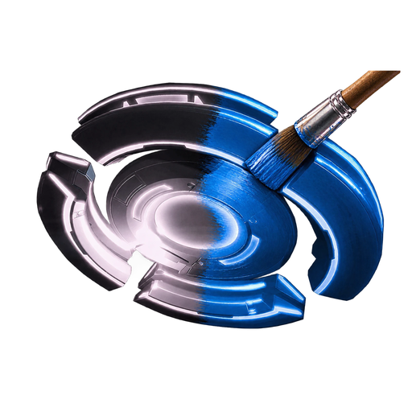

# Echo Restoration

Tools that bring back parts of Echo VR's older look on the final PC build.

## DiscGlow

Custom colours for the disc's glowing grid sphere, and the orange personal disc from 2018.

- **Personal disc:** gives your personal disc's sphere a colour again (2018 orange by default) instead of plain white.
- **Team colours:** pick your own colours for the blue team's and orange team's disc.
- **Sticky team colour:** the disc keeps its team colour until the other team touches it, instead of fading back to neutral. A new round still starts neutral.
- **Live:** colour changes apply straight away, even while Echo is running.

### Requirements

- Echo VR for PC (the final build, as installed by the Meta / Oculus app) on any PC VR headset.
- Windows 10 or 11.

If your `echovr.exe` is a different build, the installer tells you, and DiscGlow stays inactive instead of risking a crash.

### Install

1. Download `DiscGlowSetup.exe` from [Releases](../../releases).
2. Run it. It finds Echo on its own; if not, click **Browse** and pick the `ready-at-dawn-echo-arena` folder.
3. Click **Install / Update**, then **Launch Echo**.
4. Pick your colours with the sliders (red, green, blue and saturation for each disc). Values above 1 glow brighter.

**Uninstall:** click **Uninstall** in the same app. Your colour settings are kept.

### Works with other mods

DiscGlow installs as `dinput8.dll` next to `echovr.exe`. If another mod already uses that name (for example ReShade), the installer renames it to `dinput8.chain.dll`, and DiscGlow loads it, so both keep working. Uninstalling gives it its name back.

### Settings

The app writes `DiscGlow.ini` next to `echovr.exe`. You can also edit it by hand while the game runs:

| Setting | Default | Meaning |
| --- | --- | --- |
| `PersonalDisc` | `1` | Colour personal disc spheres |
| `PersonalDiscColour` | `1 0.5 0.15` | Linear RGB; above 1 glows brighter |
| `BlueTeamColour` | `0 0.698 1` | The game's own blue |
| `OrangeTeamColour` | `1 0.5 0.15` | The game's own orange |
| `PersonalDiscSaturation`, `BlueTeamSaturation`, `OrangeTeamSaturation` | `1` | 0 grey, 1 unchanged, 2 extra vivid |
| `StickyTeamColour` | `1` | Keep the team colour until the other team touches the disc |
| `Log` | `0` | Write `DiscGlow.log` |

### How it works

Echo colours the disc sphere per team by setting a per-object colour through one engine function. DiscGlow hooks that function (with [MinHook](https://github.com/TsudaKageyu/minhook)) and:

- swaps the game's blue and orange disc colours for the ones you chose, keeping the brightness of the game's fades and pulses;
- replaces the fade back to neutral after a touch with the last team colour;
- colours personal disc spheres, which the game never colours itself, by finding plain-white spheres that move in the groups of objects that hold discs.

No game files are changed.

### Building

Needs Visual Studio with the C++ desktop tools (the scripts use Visual Studio 2026's `vcvars64.bat`; change the path in `discglow\build.cmd` for other versions).

1. `discglow\build.cmd` builds `discglow\dinput8.dll`.
2. `discglow\installer\build.cmd` builds `DiscGlowSetup.exe` with that DLL embedded, using the C# compiler that ships with Windows.

## Credits

- [MinHook](https://github.com/TsudaKageyu/minhook) by Tsuda Kageyu (BSD 2-Clause, see `discglow/minhook/LICENSE.txt`).
- Echo VR by Ready At Dawn. This project is not affiliated with Ready At Dawn or Meta.
